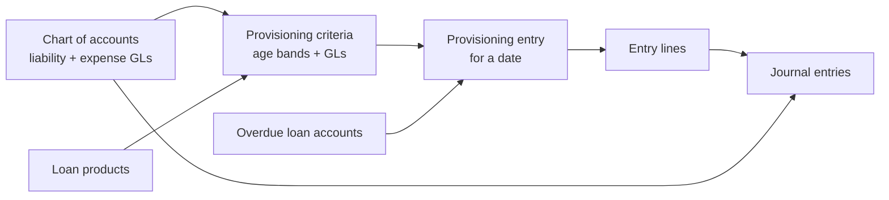

---

title: Loan-loss provisioning
description: How criteria, provisioning entries, loans, GL accounts, and journal entries fit together.
youtubeId: j4Unoq0mIVI
---

Loan-loss provisioning is how a lender **sets aside reserves** against
outstanding loans that are overdue. Bankayo implements Fineract’s
provisioning model in two screens:

1. **[Loan provisioning criteria](/help/organization/loan-provisioning-criteria)**
   (Organization) — the rules: which loan products, which overdue-day bands,
   what reserve percentage, and which liability and expense GL accounts apply.
2. **[Provisioning entries](/help/accounting/provisioning-entries)**
   (Accounting) — the calculation run for a date, and optional posting of the
   reserve journals.

This page explains the **ecosystem**: every entity involved, how they connect,
and the order you set things up.

## What it does

On a chosen date Fineract looks at **overdue loan portfolios**, matches each
loan to a **provisioning category** by days past due, applies the **reserve
percentage** from your criteria, and produces **reserved amounts** grouped by
office, loan product, and category.

When you **create journals**, Fineract posts balanced entries to the
**liability** and **expense** GL accounts you configured on the criteria —
those lines appear under [Journal entries](/help/accounting/journal-entries).

Provisioning is an **accounting reserve** exercise. It is separate from
[delinquency buckets](/help/organization#delinquency-buckets) (collection
workflow labels) and separate from [loan product
accounting](/help/products/loans/accounting) (disbursement, repayment, and
income GL mappings).

## Entities in play

| Entity | Where it lives | Role in provisioning |
| --- | --- | --- |
| **Chart of accounts** | Accounting → Chart of accounts | Supplies **liability** and **expense** detail GL accounts used on each age band. These are not the loan portfolio or income accounts from product accounting. |
| **Loan product** | Products → Loans | Criteria bind one or more products. Fineract only reserves against loans on those products. |
| **Loan account** | Clients → loan workspace | Source data: outstanding balance and **days overdue** on the provisioning date. No provisioning screen edits loans directly. |
| **Provisioning category** | Fineract platform (STANDARD, SUB-STANDARD, DOUBTFUL, LOSS, …) | Fixed aging **labels** from the template. You configure min/max overdue days and reserve % per category inside a criteria. |
| **Provisioning criteria** | Organization → Loan provisioning criteria | Named ruleset: criteria name, loan products, and one row per category (age band, reserve %, liability GL, expense GL). |
| **Provisioning entry** | Accounting → Provisioning entries | One calculation per **date** (on or before today). Stores who ran it and whether journals are posted. |
| **Entry line** | Detail view on an entry | One row per office × product × category match: overdue days, amount reserved, liability and expense account codes. |
| **Journal entry** | Accounting → Journal entries | Ledger posting after **Create journals**. Debits expense, credits liability (per Fineract’s provisioning journal logic). |

## Prerequisites (setup order)

Work through this chain before your first successful entry:

1. **[Chart of accounts](/help/accounting/chart-of-accounts)** — Create or
   identify **detail** GL accounts:
   - **Liability** accounts (type Liability) for the provision balance sheet
     side.
   - **Expense** accounts (type Expense) for the income-statement charge.
   Both must allow manual entries if you inspect them on the chart.

2. **[Loan products](/help/products/loans)** — Products must exist and be
   used on live loans. Cash or accrual accounting on the product is unrelated
   to provisioning GL pickers, but you need real overdue loans for non-zero
   reserves.

3. **[Loan provisioning criteria](/help/organization/loan-provisioning-criteria)**
   — At least one criteria with:
   - A name and one or more loan products.
   - Every Fineract category filled in with contiguous overdue-day bands,
     reserve percentages, and the liability and expense GL accounts from step 1.

4. **[Provisioning entries](/help/accounting/provisioning-entries)** — Pick a
   date on or before today. Fineract refuses create if no criteria exist.

## End-to-end workflow

### 1. Define criteria (Organization)

Open **Organization → Loan provisioning criteria**.

- **New criteria** runs a wizard: **Setup** (name + loan products) → one step
  per Fineract category → **Review**.
- The first category’s **min age** starts at day 0. Each following category’s
  min age is **one day after** the previous category’s max age — bands must
  be contiguous with no gaps or overlaps.
- On each category step you set **max age**, **reserve %**, **liability GL**,
  and **expense GL**. Min age on later categories is derived for you.
- **Edit** opens a single-page form with the same fields in a table.

Fineract applies **all** criteria when calculating reserves; the entry screen
does not ask you to pick one.

### 2. Run provisioning (Accounting)

Open **Accounting → Provisioning entries**.

- **New entry** — date on or before today. Optionally tick **Create journal
  entries** to post immediately.
- Only **one entry per date** is allowed. There is **no delete**.
- **Click a row** to see lines: office, product, category, overdue days,
  amount reserved, and the liability and expense accounts from criteria.

### 3. Post or adjust journals

- **Create journals** (list row menu or detail) posts reserve lines while
  journals are not yet posted.
- **Recreate lines** recalculates amounts if criteria changed **before**
  journals are posted.
- After posting, **View journal entries** jumps to the ledger. Reserve
  postings appear with other system and manual journals.

### 4. Verify on the ledger

Open [Journal entries](/help/accounting/journal-entries). Filter by date and
office to find the provisioning transaction. Amounts use the currency
**code** (`KES`, not a symbol).

## How criteria maps to entry lines

For each overdue loan on the entry date Fineract:

1. Finds criteria that include the loan’s **product**.
2. Picks the **category row** whose min/max overdue-day band contains the
   loan’s days past due.
3. Applies **provisioning percentage** × eligible outstanding balance (per
   Fineract’s engine).
4. Aggregates into **entry lines** with the **liability** and **expense**
   accounts from that category row.

If no loan matches a band, lines for that office/product/category may be empty
or zero. An entry with no matching loans still creates metadata but may show
no lines.

## Permissions

| Permission | Screen |
| --- | --- |
| `READ_PROVISIONINGCRITERIA` | See criteria list |
| `CREATE_PROVISIONINGCRITERIA` | New criteria wizard |
| `UPDATE_PROVISIONINGCRITERIA` | Edit criteria |
| `DELETE_PROVISIONINGCRITERIA` | Delete criteria (blocked if an entry used them) |
| `CREATE_PROVISIONENTRIES` | Open provisioning entries, create entry |
| `CREATE_PROVISIONJOURNALENTRIES` | Create journals |
| `RECREATE_PROVISIONENTRIES` | Recreate lines before journals post |

Fineract has **no read permission** for provisioning entries. Bankayo shows the
screen when you hold any of the three entry permissions above.

## Constraints and Fineract rules

- **Criteria before entries** — create is refused until at least one criteria
  exists.
- **One entry per date** — pick a different date or adjust the existing entry.
- **No delete** on entries — plan dates carefully.
- **Contiguous age bands** — each category starts the day after the previous
  one ends.
- **Liability GL** must be a liability account; **expense GL** must be an
  expense account (validated against the chart).
- **Criteria delete** — Fineract refuses if a provisioning entry still
  references that criteria.
- **Posted journals** — recreate is only available while journals are **not
  posted**.

## Related help

- [Loan provisioning criteria](/help/organization/loan-provisioning-criteria) —
  wizard, edit form, and field-level detail.
- [Provisioning entries](/help/accounting/provisioning-entries) — list,
  create, export, and row actions.
- [Chart of accounts](/help/accounting/chart-of-accounts) — GL types and
  detail accounts.
- [Journal entries](/help/accounting/journal-entries) — ledger after posting.
- [Loan product accounting](/help/products/loans/accounting) — product GL
  mappings (separate from provisioning reserve accounts).

The address bar for criteria is **Organization › Loan provisioning criteria**.
For entries it is **Accounting › Provisioning entries**.
